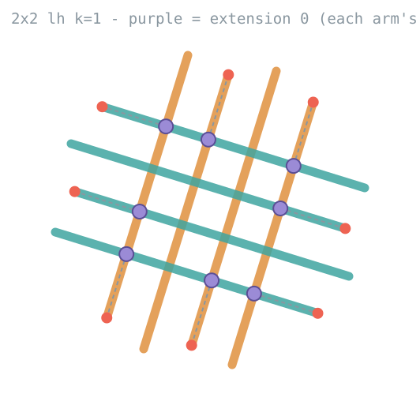

# The algorithm

Everything here lives in `src/mxn_continuation_next.py`. The hand-specific
engines (`src/mxn_lh_continuation.py`, `src/mxn_rh_continuation.py`) still do the
alignment search, but every level -- including level 1 -- is now grown by the
same continuation constructor.

## 1. Level bookkeeping

Suffixes advance by two per level:

```
level 1:  _2/_3  --k1-->  _4/_5
level 2:  _4/_5  --k2-->  _6/_7
level 3:  _6/_7  --k3-->  _8/_9
level L:  _(2L)/_(2L+1)  --kL-->  _(2L+2)/_(2L+3)
```

Every level takes its own `k`, positive, zero or negative. `level_suffixes(L)`
returns `(src_a, src_b, dst_a, dst_b)`; `_bump_suffix` renames across the step.

## 2. The virtual relabel

The engines only know how to align a ring called `_4/_5` sitting on parents
called `_2/_3`. So each level presents its source ring under those names, runs
the untouched engine code, and copies the geometry back out.

`build_level_relabel(hand, m, n, k_prev, direction, level, prev_virtual_to_real)`
builds the map. It works by pairing the previous level's k-based H/V order lists
positionally against the canonical `k = 0` order lists — the previous level's
order *is* the spatial order across each band, so position is the correct
correspondence. With `k1 = 0` the map comes out as the identity, which is the
sanity check.

**The map must be composed through the previous level's map.** The k_prev order
lists name strands in the previous level's *virtual* frame; the real arm playing
such a role is that frame's real parent, bumped one level — not simply the same
set re-suffixed. With `k = +1` the level-2 relabel swaps the suffix roles inside
every horizontal set (real `1_5` plays virtual `1_2`), so a level-3 relabel
built without the composition reverses each horizontal pair's spatial order.
That was the original level-3 failure: the k-based groups spanned ~55° (an
impossible alignment request), the family rescue re-split them into set-aligned
bands, and the level aligned into the shape of a `k = +1` twist regardless of
its own `k` — visibly the wrong stitch, even when every audit number read clean.
Composed, the virtual ring is an honest starting stitch at any depth: every
level aligns natively on the k-based groups with the engine's own pairing and
mask rule, level 3 of `[1, 1, −1]` comes out with the mixed-set bands a real
`k = −1` twist has (compare level 1 at `k = −1`), and levels 4+ — previously
"infeasible" — just work. Callers thread each level's `virtual_to_real` into
the next `add_continuation_level`; omitting it falls back to the direct
re-suffix, which is only correct for level 2.

`_build_virtual_view` deep-copies the source ring and its children into that
naming; `_copy_geometry` writes results back onto the real strands.

## 3. Growing a level — `add_continuation_level`

For each arm of the source ring:

1. **Find its paired point.** `build_symbolic_pairings` reproduces the engine's
   perimeter pairing from labels alone. The engine's own `compute_emoji_pairings`
   derives it from coordinates (side classification by `|dx| >= |dy|`, then sort),
   which is correct for an axis-aligned starting stitch and meaningless once a
   ring has been rotated by an arbitrary `k`. The symbolic version was verified
   against the engine for every `m, n` in 1..4, every `k`, both directions, both
   hands.

2. **Retract the arm to its anchor.** See §4.

3. **Weld a stub on.** The stub starts at the retracted end and runs
   `TAIL_OFFSET = 56px` past the paired point.

Paired positions are resolved against `endpoints_before`, a snapshot taken
*before* any retraction, because the level-1 generator resolves them against the
un-retracted ring.

Masks over the new crossings come from `engine.get_mask_order_k`. Only half the
crossings get one; the rest come out right from draw order.

## 4. The anchor — the purple points, where extension 0 sits

**This is the single most important thing to understand about extension.**

Extension is *not* measured from the arm's end, and *not* from a flat setback.
Each arm is retracted to **its own outermost crossing with the other band** — the
weave points you can see in the stitch. That retracted point is where the next
level's stub is welded, so it is the origin of the extension axis:
**extension 0 is the purple point.**



In the diagram (regenerate with `make_anchor_diagram.py`):

- **purple** — each arm's outermost crossing with the other band. Extension 0.
- **red** — where the arm ended before retraction.
- **dashed** — the anchor distance, what the search no longer has to spend.

On the 2×2 LH starting stitch those distances are `84px` per arm, against a
flat `RETRACT` of `52px`. On rotated outer rings they can differ arm by arm,
which is the point: every arm is anchored to its own geometric feature, not to
a shared constant.

`crossing_anchors()` reads the two bands off the geometry as the ring's two
*direction families* (§6), so it needs no relabel algebra and works at any level
and any `k`. An arm that crosses nothing keeps the flat `RETRACT` fallback.

The rule starts at L0 → L1, not only on later rings. On 2×2 LH
`ks = [1, 1, −1]`, L1 settles at `(40, 10)` / `(170, 150)`, L2 at
`(150, 100)` on both bands, and L3 at `(30, 110)` on both bands. All of those
numbers are measured from the purple points.

Two consequences worth holding on to:

- An extension of `(30, 110)` at level 3 means *30px and 110px out from the purple
  points*, not from anywhere else. Extension numbers across levels are only
  comparable because they share this origin.
- The pair still slides along **its own parent's axis**, one shared value per
  outside-in pair, each member from its own purple point.

Set by `ANCHOR = "crossing"`; pass `anchor="flat"` to `add_continuation_level`
for the old behaviour. Resolved at call time, so the module constant can be
monkeypatched in experiments.

## 5. Aligning a level — `align_continuation_level`

The engine splits the ring's arms into two search groups and asks each to settle
on **one shared heading**, sliding arms along their parents by a per-pair
extension until the perpendicular gaps land inside `[strand_width + 10,
strand_width * 1.5]` = `[56, 69]`.

- Pairs are **outside-in**: `(1st, last)`, `(2nd, last-1)`, … Both members of a
  pair share one extension value, each sliding along its **own** parent's axis.
- Gaps for a 2-strand group are the perpendicular distance between the two. For
  3+ strands they are between **consecutive strands in the group's order**, with
  a sign flip on odd indices and a no-crossing direction rule.
- `_search_group` grows the extension ceiling while the winner is pinned against
  it (`200 → 300 → 450 → 680 → 1020 → 1200`), stopping at the **first interior
  optimum**. It must not chase further: an over-wide grid lets a degenerate
  long-armed solution win the variance tie-break.

### Seeding from earlier levels

An aligned ring is geometrically another starting-stitch ring, so a level-L
twist at rotation `k` is — in its virtual frame — the same problem level 1
solves at that `k`. Level 1 itself is produced by `build_level_one`, which calls
`add_continuation_level` on the L0 snapshot. `align_continuation_level` takes
`seed_extensions`, a list of `(h_combo, v_combo)` pairs. The driver passes,
first, **level 1's own solution for the level's k** (computed once per
distinct k on a fresh starting stitch), then the chain's earlier winners, most
recent first.

Each seed is tried twice, first on the k-based groups, then on the direction
families:

1. **Exactly** — a pinned search at the seed's combo (grid sized to contain
   it, the engine's angle window recomputed for it).
2. **Nearby** — a drifted ring rarely repeats a combo exactly, so a failed pin
   falls back to one small search around the seed: ceiling just above the
   seed's largest value, step 10. The long-armed optima the escalating search
   likes are simply out of reach of that grid.

The first attempt whose ring is complete wins and the full escalation search
is skipped. This keeps deep extensions near a previously successful scale and
avoids needless long-arm optima. If no seed produces a complete ring the normal
search runs unchanged, so seeding can only shorten and speed a level, never
change what is reachable. A seeded level reports `seeded` in the audit's last
column.

### The angle window

`_compute_pair_angle_range` in the engine, `first_strand` mode: the window is the
**first strand's heading ± 20°**, recomputed at every extension combo from that
strand's *shifted* start. No `m`, `n` or `k` enters it.

That constant is not a derived quantity. Measured across every `k` on 2×2 and
3×3, a level-1 group's arms arrive spanning only **1.03°–4.70°**, and the search
settles **1.55°–7.21°** from the reference — at most 36% of the budget. ±20 is
ample at level 1 *because level-1 groups arrive nearly parallel*, which is a
property of level 1 and not of the constant.

(The one size-aware mode, `avg_gaussian`, floors its half-range at
`atan(1/max(pairs, opposite))/2` — 13.28° for 2×2, 9.22° for 3×3. That is
*narrower* than 20, so there was no wider k-aware window waiting to be used.)

## 6. Direction families — the rescue

Deeper in, the k-based **name order** stops matching the ring's actual bands. At
level 3 of 2×2 `ks = [1, 1, −1]` the name-order H group spans 55.3° and V spans
49.0°; at `ks = [1, 1, 1]` both span ~88°. Those groups have **no valid
configuration at any heading and any extension** — not a search failure but an
impossible request. The arms are still perfectly pairable (every outside-in pair
antiparallel to 0.00°); they have simply stopped following the name order, so
each group holds one pair drawn from each direction family.

`_split_direction_families` re-splits the same arms by heading (mod 180): each
arm in turn seeds a candidate split, the others are ranked by angular distance
and cut in half, and the split whose wider family is narrowest wins. Within a
family the arms are ordered across the family line, which is the spatial order
the outside-in pairing expects.

The window has to grow with them. A regrouped 38° family needs **23.08°** before
any valid heading comes into range and **27.6°** to reach a good one, which puts
all 441 sampled extension combos out of reach inside ±20. So `_family_window`:

```python
half = max(20.0, fan)                    # fan = the family's own spread, mod 180
return mean - half, mean + 180.0 + half  # both directions along the family line
```

Centred on the family's own line rather than one arm (in a 38° family the first
arm sits at an extreme); floored at 20 so it is never narrower than what ships;
and spanning 180° extra because a family's best heading can sit antiparallel to
its reference — measured, one family's best solution is at `θ = 35°` against a
reference of `−117.4°`.

A custom range is static (the engine only recentres the *automatic* window per
combo), which is what a rescue wants: an absolute band around the family's own
line, sized to its own fan.

## 7. Why crossings and not gaps

The gap test looks *inside* a band and reads clean on a ring that has folded
over. On 2×2 `ks = [1, 1, 1]`, level 3 reports `ok/ok` with gaps of
`56.47/56.60` — as tight as anything in the working range — on a ring carrying
8 of its 16 crossings.

So the level is judged by `_ring_crossings`, scored as **`across − within`**:

- `across` — crossings between the ring's two direction families.
- `within` — crossings inside a family. Must be zero; a band's arms are parallel.

Counting only the total is not enough: a ring reaches `(2m)(2n)` through the
wrong pairs just as easily as the right ones. On 2×2 `ks = [1, 1, −1]` level 3
hit 16 while `3_8` crossed `3_9` and `4_8` crossed `4_9` — same-set arms, which
in a real stitch never meet.

**The gate.** Align with the k-based groups; if the ring falls short of
`(2m)(2n)`, align again on the direction families and keep whichever ring scores
higher. No threshold to tune, and a complete ring is never second-guessed, so
levels that already work never reach the retry.

## 8. Mirroring the bands

A square stitch should be symmetric, and on 2×2 it comes out that way unprompted
— every level lands on the same combo for H and V. On 3×3 the bands disagree, and
the one that stayed nearer its anchor is the one that looks right.

`_mirror_extensions` copies the near band's combo onto the far one and keeps it
if the ring is no worse. The near band's combo is not always *legal* on the other
band (measured: H's `(10, 30, 20)` is never a valid configuration for V at 3×3
level 3), so the far band then tries donating instead — a symmetric stitch on the
far band's combo still beats two bands that disagree.

`_pinned_search` returns the configuration at a **given** combo rather than the
one the search would pick, by listening to the engine's `on_config_callback` and
keeping the best-variance instance of the target combo. The grid is sized to
contain the target exactly: step = `gcd` of its values, ceiling = its maximum.

Applies to levels ≥ 2 on square sizes only (`mirror_sides`). Level 1 uses the
same crossing-anchor origin but does not apply this optional mirroring pass.

## 9. Re-laying the masks

Masks are built in `add_continuation_level`, **before** the level is aligned, and
paired by the engine's k-based H/V split. When the rescue aligns the ring on
direction families instead, half of them name two arms that never meet — on 2×2
`ks = [1, 1, −1]` at level 3, a clean 16/16 weave with 4 of its 8 masks on empty
air. No geometry check complains, because nothing in the geometry is wrong.

`_relay_masks` re-pairs them across the bands the ring actually has.
`_mask_pairs` restates `get_mask_order_k`'s rule so it can be applied to bands
the engine never named: every other arm of the vertical band takes the even
horizontals and the rest take the odd ones, phase set by the parity of `k`.

Two things matter beyond landing on crossings:

- **Direction.** Several arrangements put every mask on a real crossing while
  covering a *different* half of the checkerboard, and those invert who passes
  over whom. Candidates are ranked by `_order_disagreement` — swapped neighbours
  against the engine's own `get_horizontal_order_k` / `get_vertical_order_k` —
  so the arrangement that walks the bands the way the engine does wins. That is
  what carries level 1's convention outward.
- **Colour.** A mask paints the strand it covers for. Re-pointing one without
  moving its colour leaves that patch painted for the arm it used to represent.

If the existing masks already sit on real crossings, nothing is touched; if no
arrangement scores zero stray, they are left alone rather than replaced with a
guess.

Re-laying the masks is only half the repair. Masks decide the masked half of
the crossings; the **unmasked half** comes out right only because every arm of
the horizontal band is drawn after every arm of the vertical band —
`add_continuation_level` appends the ring as v-order then h-order. A regrouped
ring's bands are a different partition of the same arms, so that draw order
goes stale: on 2×2 `ks = [1, 1, −1]` at level 3, six of the eight arms broke
over/under alternation while every mask sat on a real crossing. So
`_relay_draw_order` reorders the ring's own slots in the strand list to the
re-laid bands (v-band then h-band). Nothing outside the ring moves, and with
both repairs the level-3 weave alternates `OuOu` on every arm — the same rule
levels 1 and 2 follow.

## 10. Constants

| name | value | what it is |
| --- | --- | --- |
| `TAIL_OFFSET` | 56.0 | how far past the paired point a new tail runs |
| `RETRACT` | 52.0 | flat setback; now only the fallback for an arm that crosses nothing |
| `STRAND_WIDTH` | 46 | drives the gap window `[56, 69]` |
| `ANCHOR` | `"crossing"` | where extension 0 sits |
| `ANGLE_MODE` | `"first_strand"` | the engine's window mode |
| `ANGLE_STEP_DEGREES` | 0.5 | heading grid |
| `MAX_EXTENSION` | 100.0 | how far a middle strand may reach for the line |
| `MAX_PAIR_EXTENSION` | 200 | starting extension ceiling |
| `EXT_STEPS` | 10, 20, 25, 40, 50, 100 | extension grid steps, finest first |
| `COMBO_BUDGET` | 400 000 | caps combos, so the step coarsens only as forced |
| `EXTENSION_CEILING_CAP` | 1200 | 2×2 LH k1=2 k2=1 only reaches a real solution near 1000 |
| `FAMILY_MIN_HALF_WINDOW` | 20.0 | floor on the rescue window |

## 11. k ranges

Square: `-(m-1) … m`. Non-square: `-(m+n-1) … (m+n)`. `k = 0` short-circuits to
`preserve_continuation` with no search. `k = m + n` on a non-square is the max-k
special case, whose bespoke level-1 layout is defined in grid coordinates and is
**not** reproduced on a rotated ring — deeper levels use the generic paired
layout instead, and say so in the level note.
