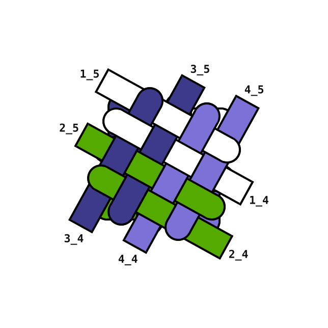
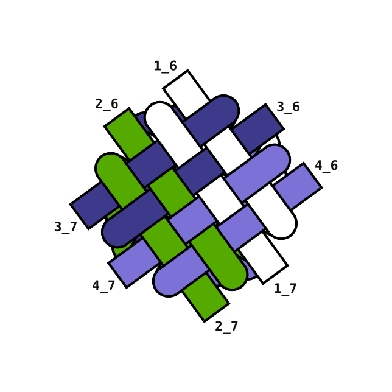
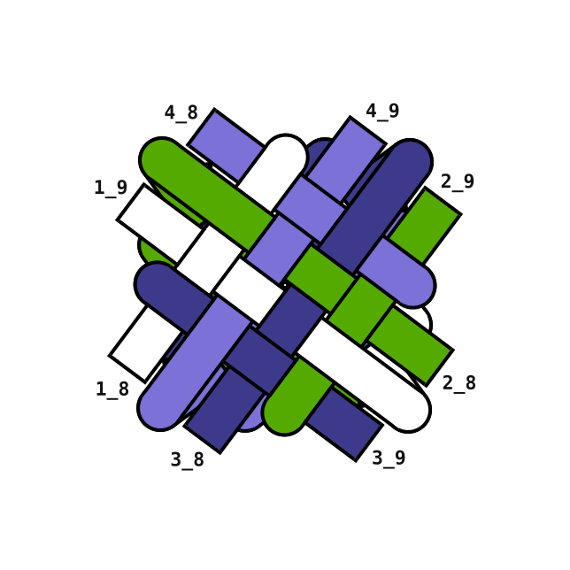
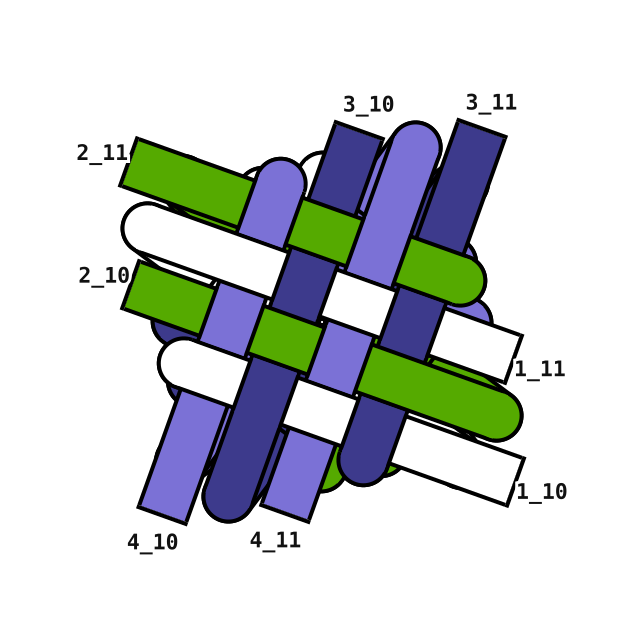
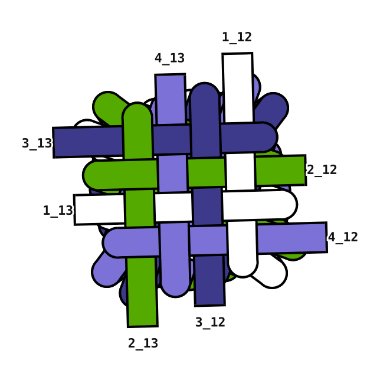
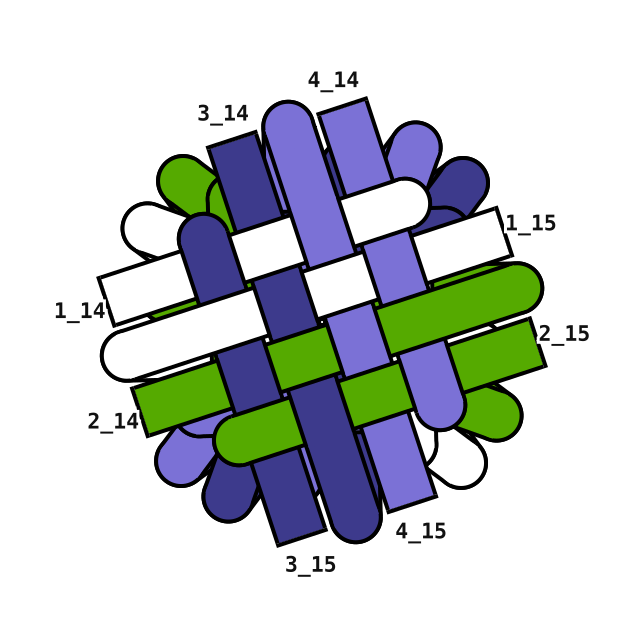
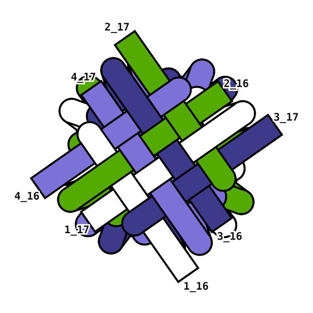

# Rendered sequences

Drawn straight from the strand JSON by [`../render_svg.py`](../render_svg.py) —
no OpenStrandStudio needed. Geometry, draw order and masks are exactly what the
algorithm produced; regenerate any sequence with:

```bash
python3 continuation/render_svg.py --out continuation/docs/2x2-seven-twists 1 1 -1 -1 -1 -1 -1
```

Self-contained HTML sheets (open in a browser):

- [`2x2_three_twists.html`](2x2_three_twists.html) — `ks = [1, 1, −1]`
- [`2x2_seven_twists.html`](2x2_seven_twists.html) — `ks = [1, 1, −1, −1, −1, −1, −1]`

## 2×2 · lh · cw · `ks = [1, 1, −1, −1, −1, −1, −1]`

Seven continuation rings, every level a complete weave (16/16 crossings across
the bands, none within a band, no stray masks, every arm alternating
over-under). All frames share one viewport, so the stitch genuinely grows.
Whites/greens are the horizontal sets, indigos the vertical sets; each set
keeps its colour outward, so any strand can be followed from the core to the
seventh ring.

| level | k | ext H · V | gap H / V | how it landed |
| --- | --- | --- | --- | --- |
| L1 | +1 | (80, 60) · (80, 60) | 56.43 / 56.41 | k-based groups |
| L2 | +1 | (90, 70) · (90, 70) | 56.58 / 56.60 | seeded |
| L3 | −1 | (40, 70) · (40, 70) | 57.30 / 57.29 | seeded |
| L4 | −1 | (30, 100) · (30, 100) | 56.35 / 56.34 | seeded |
| L5 | −1 | (40, 70) · (40, 70) | 57.58 / 57.55 | seeded |
| L6 | −1 | (30, 100) · (30, 100) | 56.85 / 56.85 | bands mirrored |
| L7 | −1 | (50, 40) · (50, 40) | 57.04 / 56.99 | bands mirrored |

### Level 1 — first



### Level 2 — ring 2



### Level 3 — ring 3



### Level 4 — ring 4



### Level 5 — ring 5



### Level 6 — ring 6



### Level 7 — ring 7


